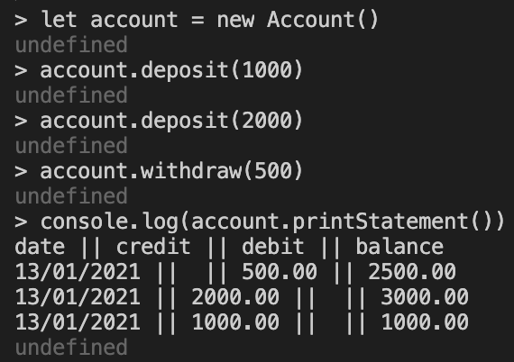
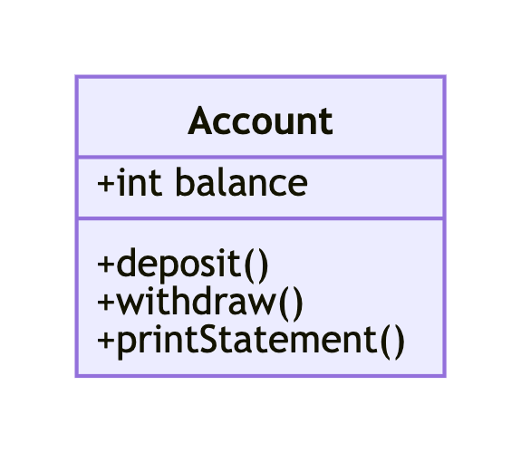

# Bank Tech Test

Bank app that can be interacted with via a REPL

## How To Use

### Set up the project

Clone the repository:

```sh
git clone git@github.com:samanthagottlieb/bank-tech-test.git
```

Navigate to the directory:

```sh
cd bank-tech-test
```

Install dependencies:

```sh
npm install
```

### Run tests and linting

Run tests:

```sh
npm run test
```

Lint code:

```sh
npx eslint 'src/**'
```

### Run the app

Start the Node.js REPL:

```sh
node
```

Require the Account file into the REPL:

```sh
const Account = require('./src/Account.js')
```

### Example Usage



## Specification

### Task

Build a bank app that can be interacted with via a REPL.

Use OO design principles and TDD. Data can be kept in memory.

Makers Academy week 10 challenge.

### Requirements

- You can make deposits
- You can make withdrawals
- You can view an account statement (showing date, amount deposited/withdrawn, balance)

### User Stories

```
As a user
So that I can add money to my bank account
I want to make a deposit

As a user
So that I can take money from my bank account
I want to make a withdrawal

As a user
So that I can see details of my bank account history
I want to view my bank statement
```

### Class Diagram



### Acceptance Criteria

#### Normal operation:

```
let account = new Account()
account.deposit(100)
account.balance => 100

let account = new Account()
account.deposit(100)
account.withdraw(25)
account.balance => 75

let account = new Account()
account.deposit(100) //on 11-01-2021
account.withdraw(25) //on 12-01-2021
account.printStatement()
  =>
date || credit || debit || balance
12/01/2021 || || 25.00 || 75.00
11/01/2021 || 100.00 || || 100.00

let account = new Account()
account.deposit(1000) //on 10-01-2012
account.deposit(2000) //on 13-01-2012
account.withdraw(500) //on 14-01-2012
account.printStatement()
  =>
date || credit || debit || balance
14/01/2012 || || 500.00 || 2500.00
13/01/2012 || 2000.00 || || 3000.00
10/01/2012 || 1000.00 || || 1000.00
```

#### Edge cases:

```
let account = new Account()
account.withdraw(100) => throw exception 'Insufficent funds in account'

let account = new Account()
account.deposit() => throw exception 'Amount to be deposited must be an integer'
account.deposit('100') => throw exception 'Amount to be deposited must be an integer'
account.deposit(null) => throw exception 'Amount to be deposited must be an integer'

let account = new Account()
account.withdraw() => throw exception 'Amount to be withdrawn must be an integer'
account.withdraw('100') => throw exception 'Amount to be withdrawn must be an integer'
account.withdraw(null) => throw exception 'Amount to be withdrawn must be an integer'
```

## Technnologies used

- ESLint - JavaScript linter tool
- Jest - JavaSript testing framework
- Mermaid - JavaScript based diagramming and charting tool
